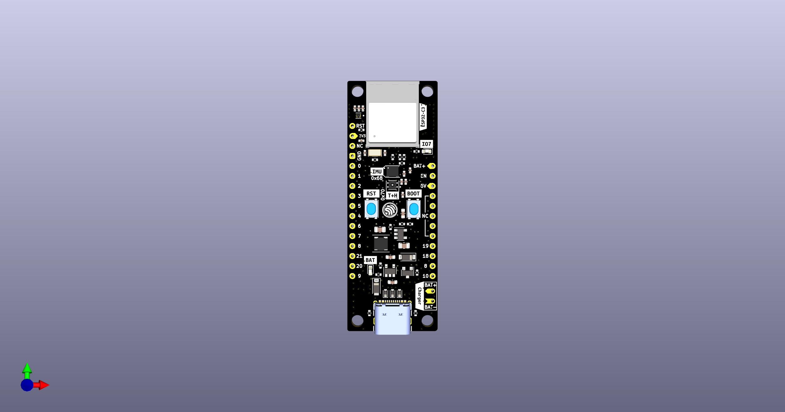
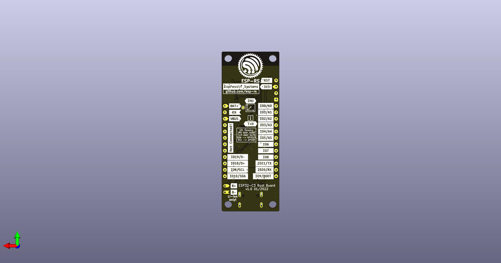

# Rust ESP Board

Welcome to the Rust ESP Development board project. This repository contains everything you will need to build the board yourself.

## Where to buy

* [ESP32-C3-DevKit-RUST-1](https://www.espressif.com/en/products/devkits)
* [AliExpress Espressif Official Store](https://www.aliexpress.com/item/1005004418342288.html)
* [Mouser Electronics](https://www2.mouser.com/ProductDetail/Espressif-Systems/ESP32-C3-DevKit-RUST-1?qs=4ASt3YYao0WvXOj9TGjU2A%3D%3D)

## Ferrous Systems Training

* [Training: Explore the power of Rust on the new Espressif board](https://ferrous-systems.com/go/trainings/esp32-c3-devkit-rust-1/)

## Project Specification 

This board is based on the ESP32-C3, and includes sensors, LEDs, buttons, a battery charger, and USB type-C connector.

### SoC Features

* IEEE 802.11 b/g/n-compliant
* Bluetooth 5, Bluetooth mesh
* 32-bit RISC-V single-core processor, up to 160MHz
* 384 KB ROM
* 400 KB SRAM (16 KB for cache)
* 8 KB SRAM in RTC
* 22 × programmable GPIOs
* 3 × SPI
* 2 × UART
* 1 × I2C
* 1 × I2S
* 2 × 54-bit general-purpose timers
* 3 × watchdog timers
* 1 × 52-bit system timer
* Remote Control Peripheral (RMT)
* LED PWM controller (LEDC)
* Full-speed USB Serial/JTAG controller
* General DMA controller (GDMA)
* 1 × TWAI®
* 2 × 12-bit SAR ADCs, up to 6 channels
* 1 × temperature sensor

For the complete description, see the [ESP32-C3 Datasheet](https://www.espressif.com/sites/default/files/documentation/esp32-c3_datasheet_en.pdf).

### I2C Peripherals

This board includes the following peripherals over the I2C bus:

| Peripheral                | Part number  | Reference                                                                   | Crate | Address |
|---------------------------|--------------|-----------------------------------------------------------------------------|-------|---------|
| IMU                       | ICM-42670-P  | [Datasheet](https://invensense.tdk.com/download-pdf/icm-42670-p-datasheet/) | [Link](https://crates.io/crates/icm42670)   | 0x68 |
| Temperature and Humidity  | SHTC3        | [Datasheet](https://www.sensirion.com/en/environmental-sensors/humidity-sensors/digital-humidity-sensor-shtc3-our-new-standard-for-consumer-electronics/)            | [Link](https://crates.io/crates/shtcx)       | 0x70 |

#### I2C Bus Connection

| Signal     | GPIO        |
|------------|-------------|
| SDA        | GPIO10      |
| SCL        | GPIO8       |

### I/Os

The following devices are connected through GPIO:

| I/O Devices | GPIO   |
|-------------|--------|
| WS2812 LED  | GPIO2  |
| LED         | GPIO7  |
| Button/Boot | GPIO9  |

### Power

* USB type-C (*no PD compatibility*).
* Li-Ion battery charger.

### Pin Layout

#### Left Side

| Pin Number | Description    | SoC        |
|------------|----------------|------------|
| 1          | Reset          | EN/CHIP_PU |
| 2          | 3V3            |            |
| 3          | N/C            |            |
| 4          | GND            |            |
| 5          | IO0/ADC1-0     | GPIO0      |
| 6          | IO1/ADC1-1     | GPIO1      |
| 7          | IO2/ADC1-2     | GPIO2      |
| 8          | IO3/ADC1-3     | GPIO3      |
| 9          | IO4/ADC2-0     | GPIO4      |
| 10         | IO5/ADC2-1     | GPIO5      |
| 11         | IO6/MTCK       | GPIO6      |
| 12         | IO7/MTDO/LED   | GPIO7      |
| 13         | IO9/LOG        | GPIO8      |
| 14         | IO21/U0RXD     | GPIO21     |
| 15         | IO20/U0TXD     | GPIO20     |
| 16         | IO9/BOOT       | GPIO9      |

#### Right Side

| Pin Number | Description    | SoC     |
|------------|----------------|---------|
| 1          | VBAT           |         |
| 2          | EN [1]         |         |
| 3          | VBUS [2]       |         |
| 4          | NC             |         |
| 5          | NC             |         |
| 6          | NC             |         |
| 7          | NC             |         |
| 8          | NC             |         |
| 9          | IO19/USB_D-    | GPIO19  |
| 10         | IO18/USB_D+    | GPIO18  |
| 11         | IO8/SCL        | GPIO8   |
| 12         | IO10/SDA       | GPIO10  |

  * [1] Connected to LDO enable pin*
  * [2] Connected to USB 5V*

## Project KiCad Libraries

* [ESP32C3](https://github.com/espressif/kicad-libraries)

## Board Design

Top

Bottom

## Bill of Material

[Interactive BOM](https://esp-rs.github.io/esp-rust-board/)
